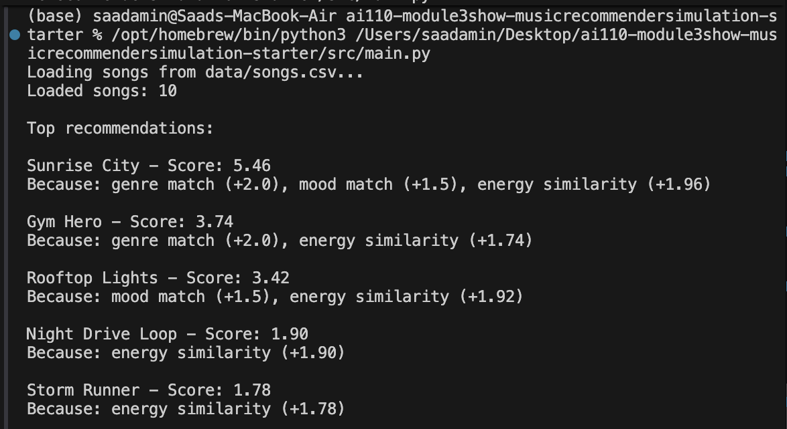
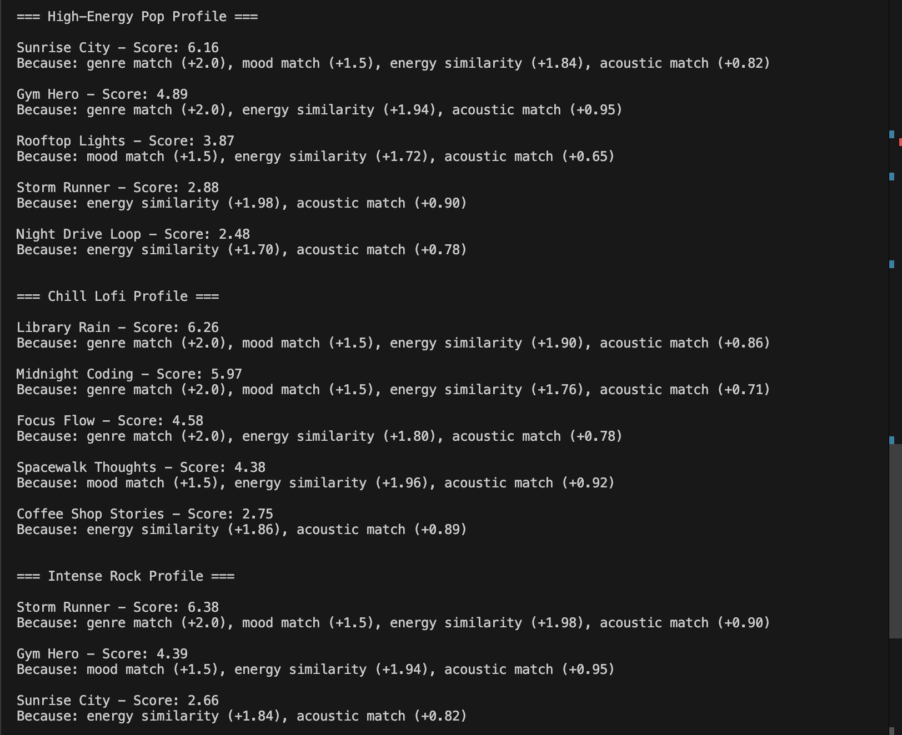
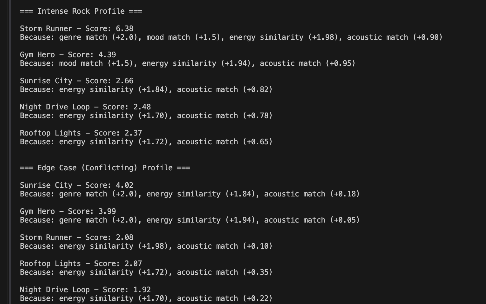
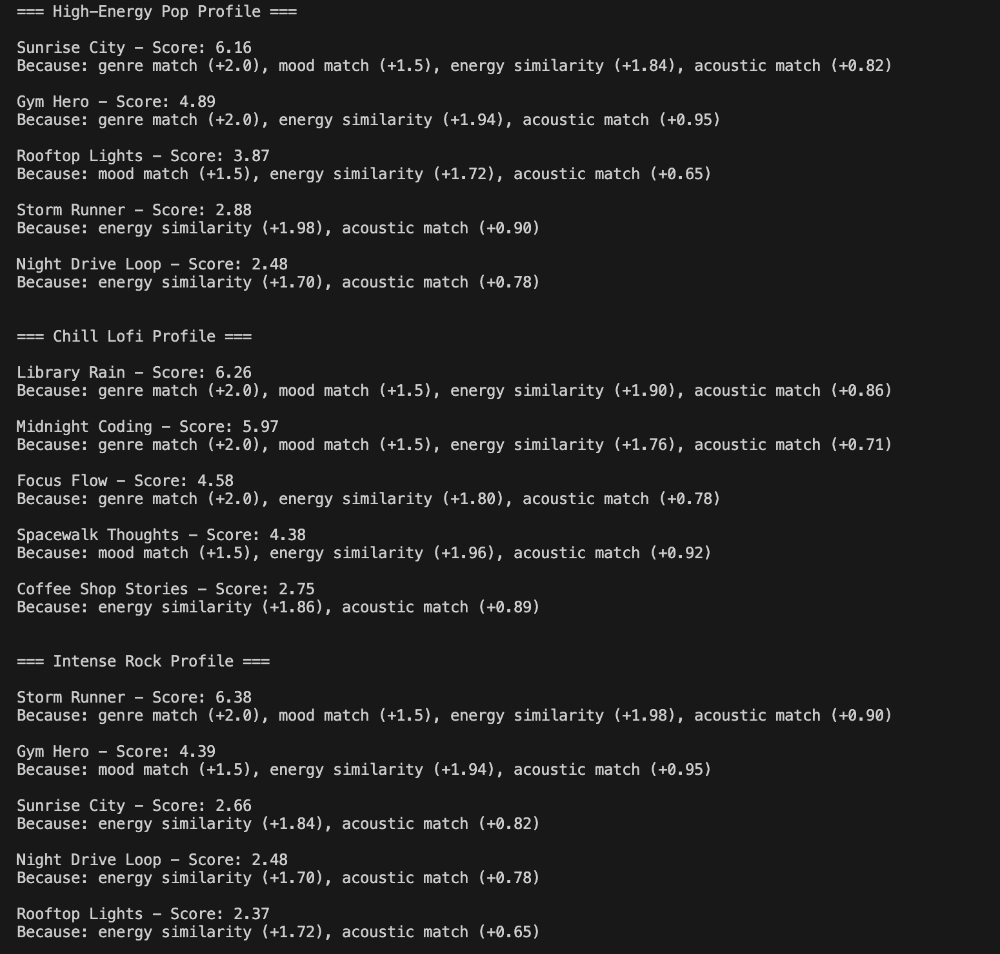
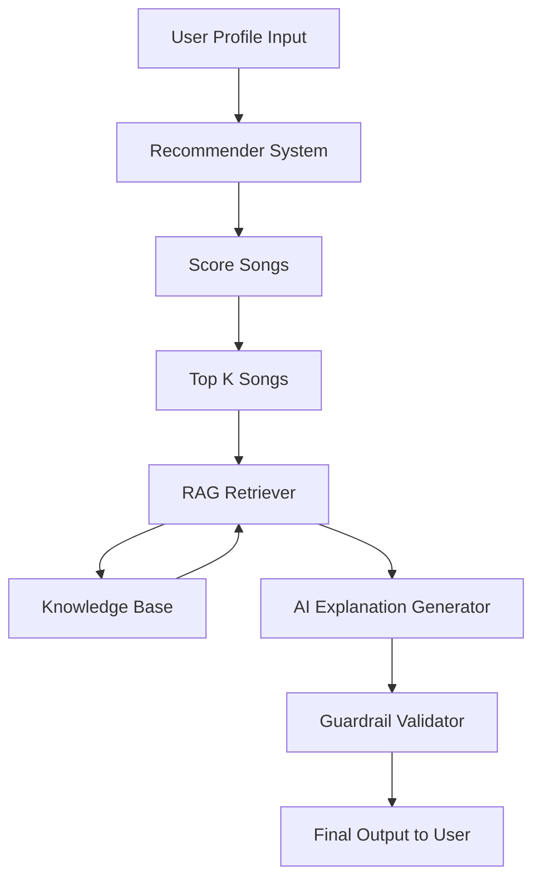

# 🎵 Music Recommender Simulation

## Base Project

This is **Project 4: Applied AI System**, built by extending my earlier **Project 3: Music Recommender Simulation** (the original CLI-based content scoring recommender in this same repo).

**Original scope (Project 3):**
- A CLI tool that loads songs from `data/songs.csv`
- A scoring rule that ranks songs against a `UserProfile` (genre, mood, target energy, acoustic preference)
- A short text "explanation" listing which rules contributed to each score
- No retrieval, no external knowledge, no validation layer

**What Project 4 adds on top of that base:**
1. A local **knowledge base** (`knowledge/music_knowledge.txt`)
2. A **RAG retriever** (`src/rag.py`) using keyword overlap
3. An **AI explanation generator** (`src/ai_assistant.py`) that fuses the score + reasons + retrieved context
4. A **guardrail validator** (`src/guardrails.py`) that flags generic explanations
5. An **evaluation harness** (`src/evaluate.py`) that reports `X/Y passed` across multiple profiles

The original `recommender.py` and CSV format are unchanged — the AI layer wraps them.

---

## Project Summary

In this project you will build and explain a small music recommender system.

Your goal is to:

- Represent songs and a user "taste profile" as data
- Design a scoring rule that turns that data into recommendations
- Evaluate what your system gets right and wrong
- Reflect on how this mirrors real world AI recommenders

This project implements a simple content-based music recommender system that suggests songs based on a user’s taste profile. Instead of using other users’ behavior, the system analyzes song attributes such as genre, mood, and energy to find songs with a similar “vibe.” Each song is scored based on how closely it matches the user’s preferences, and the highest-scoring songs are recommended. This project demonstrates the core ideas behind real-world recommendation systems in a simplified and interpretable way.

---

## How Real-World Recommenders Work

Real-world music recommendation systems like Spotify and YouTube use a combination of user data and song features to predict what users will enjoy. These systems collect input data such as songs a user has liked, skipped, or added to playlists, along with features like genre, mood, tempo, and listening history.

There are two main approaches. Collaborative filtering uses patterns from other users with similar behavior to suggest songs, while content-based filtering recommends songs with similar attributes to ones the user already likes.

In these systems, the input data (song features and user history) is combined with user preferences to calculate a relevance score for each song. The system then ranks all available songs and selects the highest-scoring ones to recommend. This ranking process is what determines what appears in a user’s feed or playlist.

## How The System Works

This recommender system works by comparing user preferences to song attributes and assigning each song a score based on how well it matches the user’s taste.

Each Song includes features such as genre, mood, energy, tempo_bpm, valence, and acousticness. These features represent different aspects of a song’s overall vibe, such as how energetic, emotional, or acoustic it feels.

The UserProfile stores the user’s preferences, including their favorite genre, favorite mood, target energy level, and whether they prefer acoustic music. These preferences define what kind of songs the system should prioritize.

### User Profile Example

The system uses a user profile to represent musical preferences. For example:

- Favorite genre: pop  
- Favorite mood: happy  
- Target energy: 0.8  
- Prefers acoustic: false  

This profile represents a user who enjoys upbeat, energetic music and prefers more produced (non-acoustic) sounds.

To generate recommendations, the system computes a score for each song using a combination of rules:

Songs receive a strong score boost if their genre matches the user’s favorite genre.  
Songs receive additional points if their mood matches the user's preferred mood, helping the system capture the emotional "vibe" the user is looking for.  
Numerical features like energy are scored based on how close they are to the user’s target value, so songs that closely match the desired energy receive higher scores.  
Songs may also receive a bonus if their acousticness matches the user’s preference.

After all songs are scored, the system ranks them from highest to lowest score and selects the top results as recommendations. This ensures that the songs returned are the best overall match for the user’s preferences.

### Algorithm Recipe

The recommender assigns a score to each song based on how well it matches the user's preferences.

* +2.0 points if the song's genre matches the user's favorite genre  
* +1.5 points if the song's mood matches the user's preferred mood  
* Songs receive additional points based on how close their energy level is to the user's target energy. Songs with similar energy are scored higher.  
* Songs are also adjusted based on whether they match the user's preference for acoustic or non-acoustic music  

After scoring all songs, the system sorts them from highest to lowest score and returns the top recommendations.

### Potential Bias

This system may over-prioritize genre, which could cause it to ignore songs from different genres that still match the user’s mood or energy. It also simplifies musical taste by focusing on a small set of features and does not account for real-world factors such as listening context or past behavior.

### System Flow

User Preferences → Score Each Song → Rank Songs → Return Top K Recommendations

First, the system reads the user’s preferences. Then it evaluates every song in the dataset using the scoring rules. After assigning scores, it sorts the songs from highest to lowest and returns the top results.

---

## Getting Started

### Setup

1. Create a virtual environment (optional but recommended):

   ```bash
   python -m venv .venv
   source .venv/bin/activate      # Mac or Linux
   .venv\Scripts\activate         # Windows

2. Install dependencies

```bash
pip install -r requirements.txt
```

3. Run the recommender (with RAG explanations):

```bash
python src/main.py
```

4. Run the evaluation script (3 profiles + guardrail report):

```bash
python src/evaluate.py
```

> Note: run from the project root so the relative paths `data/songs.csv` and `knowledge/music_knowledge.txt` resolve.

### Running Tests

Run the starter tests with:

```bash
pytest
```

You can add more tests in `tests/test_recommender.py`.

---

## Experiments You Tried

Below is an example of the recommender system output for a "pop/happy" user profile:




Use this section to document the experiments you ran. For example:

- What happened when you changed the weight on genre from 2.0 to 0.5
- What happened when you added tempo or valence to the score
- How did your system behave for different types of users

SS of profiles 





### Comparison of Results

The High-Energy Pop profile recommended songs like "Sunrise City" and "Gym Hero", which have high energy and match the pop genre. This shows that the system correctly prioritizes both genre and energy for upbeat music.

The Chill Lofi profile produced very different results, with songs like "Library Rain" and "Midnight Coding" appearing at the top. These songs have lower energy and higher acousticness, showing that the system adapts well to relaxed and acoustic preferences.

The Intense Rock profile strongly favored "Storm Runner", which matches both the rock genre and high energy level. Compared to the pop profile, the recommendations shifted toward more intense and aggressive songs.

Overall, the system responds well to different user preferences, but some songs like "Gym Hero" still appear across profiles due to strong energy similarity. This shows that energy has a strong influence on the scoring.


### Weight Shift Experiment

I modified the scoring system by reducing the importance of genre and increasing the importance of energy.



After this change, songs with similar energy levels appeared more frequently, even if they did not match the user’s preferred genre. This made the recommendations more diverse but sometimes less accurate in terms of musical style.

---

## Limitations and Risks

Summarize some limitations of your recommender.

Examples:

- It only works on a tiny catalog
- It does not understand lyrics or language
- It might over favor one genre or mood

You will go deeper on this in your model card.

---

## Architecture Diagram



---

## AI Extension (RAG-Based Recommender)

This project was extended with a Retrieval-Augmented Generation (RAG) system that enhances recommendation explanations.

The system now:

* Retrieves relevant music knowledge from a local knowledge base
* Combines that information with scoring results
* Generates more informative explanations
* Uses guardrails to ensure explanations reference actual song features

Example output:

* Song name
* Score
* Explanation + retrieved context

Run the extended pipeline with:

```bash
python src/main.py
python src/evaluate.py
```

---

## Sample Output

```
=== High-Energy Pop Profile ===

Sunrise City - Score: 6.16
Explanation: This song matches your preferences (genre match (+2.0), mood match (+1.5), energy similarity (+1.84), acoustic match (+0.82)). Context: High-energy songs are often good for workouts or parties because they have strong rhythm and fast tempo. Rock and intense songs usually feel powerful due to high energy and aggressive instruments.

Gym Hero - Score: 4.89
Explanation: This song matches your preferences (genre match (+2.0), energy similarity (+1.94), acoustic match (+0.95)). Context: Rock and intense songs usually feel powerful due to high energy and aggressive instruments. High-energy songs are often good for workouts or parties because they have strong rhythm and fast tempo.
```

The evaluation script reports guardrail pass rates across the three profiles, e.g. `Guardrail results: 9/9 passed`.

---

## Reliability / Guardrails

The system includes a validation step that checks whether explanations mention real song features like genre, mood, or energy.

If not, a warning is added. This prevents misleading or generic explanations.

The guardrail logic lives in `src/guardrails.py` and is invoked from `src/ai_assistant.py` after every explanation is generated. The evaluation script in `src/evaluate.py` reports how many explanations pass for a given run.

### How the guardrail behaves

**Pass case** (explanation mentions real song features — `genre`, `mood`, or `energy`):

```
[PASS] Library Rain (score 6.26)
   This song matches your preferences (genre match (+2.0), mood match (+1.5),
   energy similarity (+1.90), acoustic match (+0.86)). Context: Chill and lofi
   songs are better for studying or relaxing because they have lower energy
   and softer sounds.
```

**Fail case** (if a future change produced an explanation like `"Recommended for you."`):

```
Recommended for you. [WARNING] Explanation may be too generic — does not
reference genre, mood, or energy.
```

The validator is a single function — `validate_explanation()` in `src/guardrails.py` — that returns `False` when none of the required terms appear, triggering the warning append in `ai_assistant.py`. On the current 3-profile evaluation, the run reports `Guardrail results: 9/9 passed`.

---

## Reflection

This project showed how even simple recommendation systems can feel intelligent when they combine data with structured reasoning.

Using AI tools helped speed up development, especially when generating boilerplate code and structuring new features like RAG. However, some AI suggestions needed to be verified manually, especially around logic correctness and imports.

One interesting insight was how small changes in scoring weights significantly affected recommendations. It also became clear how bias can easily emerge from limited datasets or overly strong features like genre.

If extended further, I would improve the system by increasing dataset size, adding personalization over time, and using more advanced similarity methods.

### Design Reflection

**How I used AI during development:**
- Prompting the assistant to scaffold the RAG retriever, guardrail validator, and evaluation script as separate modules
- Debugging by pasting tracebacks back into the assistant
- Discussing design choices like *whether to put guardrails inside `ai_assistant.py` or as a separate post-processing step*

**One concrete *helpful* AI suggestion:**
The assistant proposed building the RAG `retrieve()` function around plain set-based keyword overlap rather than reaching for a vector library. That kept the project zero-dependency, matched the assignment's "no external libraries" rule, and is easy to inspect when debugging odd retrieval results.

**One concrete *flawed* AI suggestion:**
An early draft used `from src.recommender import ...` and recommended `python -m src.main`, but the original Project 3 layout has no `src/__init__.py` — so that form raised `ModuleNotFoundError`. I had to verify imports manually and switch to flat `from recommender import ...` plus `python src/main.py`. This was a good reminder that AI-suggested imports must be checked against the actual package structure.

**System limitations:**
- Tiny catalog (18 songs) — recommendations saturate quickly
- Keyword-overlap retrieval is shallow; it can miss semantically related chunks that share no exact words
- The guardrail only checks for keyword presence, not factual correctness of the explanation

**Future improvements:**
- Larger song catalog and richer features (lyrics, embeddings)
- Replace keyword overlap with sentence embeddings for retrieval
- Stronger guardrails: cross-check that the cited features actually appear in the song's row
- Personalization that adapts weights based on user feedback over time

See also `model_card.md`:

[**Model Card**](model_card.md)


---

## 🧪 Experiments & Results

The following terminal screenshots show the recommender system running across three different user profiles, plus the evaluation script with guardrail results.

### High-Energy Pop Profile


### Chill Lofi Profile


### Intense Rock + Guardrails


### Observations

- High-energy profiles return energetic songs (e.g. *Sunrise City*, *Gym Hero*, *Festival Lights*).
- Chill profiles return low-energy acoustic songs (e.g. *Library Rain*, *Midnight Coding*, *Deep Focus Waves*).
- The Rock profile prioritizes intense songs (e.g. *Storm Runner*, *Trap Thunder*).
- Some songs repeat across profiles due to strong energy weighting in the scoring rule.
- Guardrails passed successfully — every generated explanation referenced genre, mood, or energy (`9/9 passed`).

---
